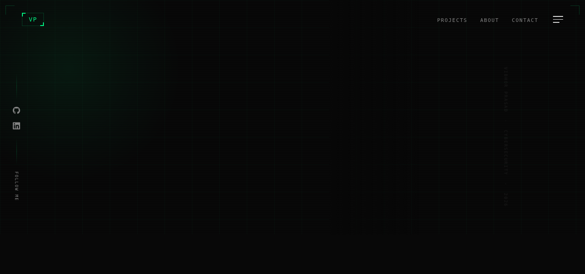

<!--
  ╔═══════════════════════════════════════════════════════════╗
  ║                                                           ║
  ║        VIBHOR PRASAD | Cybersecurity Professional         ║
  ║                                                           ║
  ╚═══════════════════════════════════════════════════════════╝
-->

<div align="center">



---

### 🔗 Connect With Me

[](https://instagram.com/_.vibhxrr)
[](https://www.linkedin.com/in/vibhor-prasad-3ba373381/)
[](https://github.com/stack-guardian)
[](mailto:vibhorprasad14@gmail.com)

---

</div>

## 📜 About Me

```yaml
name: Vibhor Prasad
username: stack-guardian
pronouns: he/him
location: Bhopal, India
status: 🟢 Active

education:
  degree: B.Tech in Cyber Security
  
certifications:
  - name: CNSP (Certified Network Security Practitioner)
    score: 85%

```

---

## 🎯 Currently

```python
Web Application Security Testing,
Offensive Security Concepts,
Vulnerability Assessment & Penetration Testing,
Security Monitoring Tools Development
    
Advanced Web Exploitation (XSS, SQLi, CSRF),
Network Security & Traffic Analysis,
Python for Security Automation,
Bug Bounty Hunting Methodologies


     
```

---

## 🛡️ Technical Arsenal

```markdown
## Programming Languages
├── Python        ████████████░░  Intermediate
├── Bash          ████████░░░░░░  Beginner
└── HTML/CSS/JS   ██████░░░░░░░░  Basic

## Security Tools
├── Burp Suite    ██████████░░░░  Web Testing
├── Nmap          ████████████░░  Network Scanning
├── Wireshark     █████████░░░░░  Traffic Analysis
├── Hydra         ████████░░░░░░  Password Auditing
└── Aircrack-ng   ███████░░░░░░░  Wireless Testing

## Platforms & OS
├── Kali Linux    █████████████░  Daily Driver
├── VirtualBox    ████████████░░  Virtualization
└── Git/GitHub    ██████████░░░░  Version Control
```

---

## 🚀 Projects

### 🦅 Valkyrie
```
Name:        Valkyrie
Type:        Security Monitoring Utility
Platform:    Linux
Status:      ✅ Completed

Description:
  A Linux-based security monitoring utility designed to observe
  incoming files and system activity to help identify potentially
  harmful content using lightweight scanning logic.

Features:
  • Real-time file monitoring
  • System activity observation
  • Lightweight scanning logic
  • Threat detection alerts
```

---

## 🧪 Security Labs & Writeups

### Lab 02: Stored XSS into HTML Context

```yaml
Lab: "PortSwigger Web Security Academy - Lab 2"
Category: "Cross-Site Scripting (XSS)"
Type: "Stored XSS"
Context: "HTML Context (Nothing Encoded)"
Status: "✅ SOLVED"
Difficulty: "Apprentice"

Vulnerability Details:
  Issue: "Stored XSS vulnerability in the comment section"
  Context: "HTML context with no input encoding"
  Payload: "<script>alert(1)</script>"
  Technical Failure: "User input directly rendered as HTML without sanitization"

Impact Assessment:
  Severity: "HIGH"
  Risks:
    - "Session hijacking via cookie theft"
    - "User credential phishing"
    - "Malicious redirect attacks"
    - "Defacement and content manipulation"
    - "Information leakage about users"

Exploitation:
  Method: "Injected JavaScript payload in comment form"
  Trigger: "Any user viewing the compromised comment"
  Persistence: "Stored permanently until removed"

Remediation:
  - "Implement proper HTML encoding for user input"
  - "Use Content Security Policy (CSP) headers"
  - "Validate and sanitize all user-supplied data"
  - "Use HTTPOnly and Secure flags on cookies"
```

**Proof of Concept:**


*Figure: Successful XSS payload execution - alert(1) triggered via comment section*

---

---

## 📊 GitHub Statistics

<div align="center">


</div>

---

## 🔐 Security Domains

```yaml
Web Application Security:
  - XSS (Cross-Site Scripting)
  - SQL Injection (SQLi)
  - CSRF (Cross-Site Request Forgery)
  - SSRF (Server-Side Request Forgery)
  - IDOR (Insecure Direct Object Reference)

Network Security:
  - Packet Analysis
  - Traffic Monitoring
  - Protocol Security
  - CCNA-level Knowledge

Offensive Security:
  - Penetration Testing
  - Vulnerability Assessment
  - Bug Bounty Hunting

Tools Proficiency:
  - Burp Suite (Web Testing)
  - Nmap (Network Scanning)
  - Wireshark (Traffic Analysis)
  - Hydra (Password Auditing)
  - Aircrack-ng (Wireless Testing)
```

---

<div align="center">

### 🎯 Open to Opportunities

**Available for:** Cybersecurity Internships | Bug Bounty Collaborations | Security Research

[](https://www.linkedin.com/in/vibhor-prasad-3ba373381/)
[](https://instagram.com/_.vibhxrr)
[](mailto:vibhorprasad14@gmail.com)

---

<p align="center">
  <sub>⚔️ Built with 🛡️ and ☕ by Vibhor Prasad | stack-guardian © 2026</sub>
</p>

</div>

<!--
  ═══════════════════════════════════════════════════════════
  
  "The only secure computer is one that's unplugged, 
   locked in a safe, and buried in concrete."
  
  ═══════════════════════════════════════════════════════════
-->
