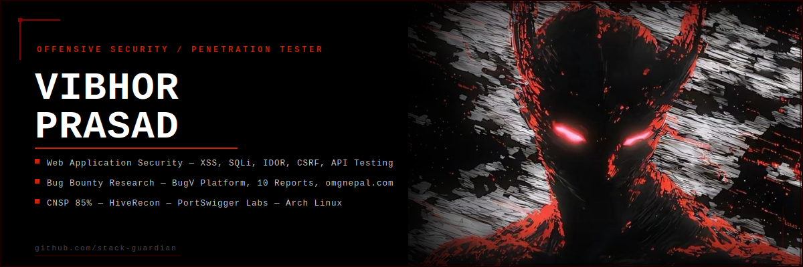

<!--
  ╔═══════════════════════════════════════════════════════════╗
  ║                                                           ║
  ║        VIBHOR PRASAD | Cybersecurity Professional         ║
  ║                                                           ║
  ╚═══════════════════════════════════════════════════════════╝
-->

<div align="center">



---

### 🔗 Connect With Me

[](https://instagram.com/_.vibhxrr)
[](https://www.linkedin.com/in/vibhor-prasad-3ba373381/)
[](https://github.com/stack-guardian)
[](mailto:vibhorprasad14@gmail.com)

---

</div>

## 📜 About Me

```yaml
name: Vibhor Prasad
username: stack-guardian
pronouns: he/him
location: Bhopal, India
status: 🟢 Active

education:
  degree: B.Tech in Cyber Security
  institution: LNCT Group of Colleges, Bhopal
  expected: June 2027
  
certifications:
  - name: CNSP (Certified Network Security Practitioner)
    score: 85%

```

---

## 🎯 Currently

```python
Web Application Security Testing,
Offensive Security Concepts,
Vulnerability Assessment & Penetration Testing,
Security Monitoring Tools Development
    
Advanced Web Exploitation (XSS, SQLi, CSRF),
Network Security & Traffic Analysis,
Python for Security Automation,
Bug Bounty Hunting Methodologies


     
```

---

## 🛡️ Technical Arsenal

```markdown
## Programming Languages
├── Python        ████████████░░  Intermediate
├── Bash          ████████░░░░░░  Beginner

## Security Tools
├── Burp Suite    ██████████░░░░  Web Testing
├── Nmap          ████████████░░  Network Scanning
├── Wireshark     █████████░░░░░  Traffic Analysis
├── Hydra         ████████░░░░░░  Password Auditing
└── Aircrack-ng   ███████░░░░░░░  Wireless Testing

## Platforms & OS
├── Kali Linux    █████████████░  Daily Driver
├── VirtualBox    ████████████░░  Virtualization
└── Git/GitHub    ██████████░░░░  Version Control
```

---

## 🚀 Projects

### 🦅 Valkyrie
```
Name:        Valkyrie
Type:        Security Monitoring Utility
Platform:    Linux
Status:      ✅ Completed

Description:
  A Linux-based security monitoring utility designed to observe 
  incoming files and system activity to help identify potentially 
  harmful content using multi-engine scanning logic (ClamAV, YARA,
  custom heuristics), real-time quarantine, and a web dashboard.

Features:
  • Real-time file monitoring with automatic quarantine
  • Multi-engine detection (ClamAV + YARA + heuristics)
  • Risk scoring and configurable thresholds
  • JSON reporting and web-based dashboard
```

### 🐝 HiveRecon
```
Name:        HiveRecon
Type:        AI-Powered Reconnaissance Framework
Platform:    Docker / Linux
Status:      ✅ Completed

Description:
  Automates the full security reconnaissance pipeline for authorized
  bug bounty and penetration testing engagements. Orchestrates
  subdomain enumeration, port scanning, endpoint discovery, and
  vulnerability scanning through Groq AI-coordinated agents.

Features:
  • Automated recon pipeline (subfinder, nmap, katana, nuclei)
  • Groq AI orchestration and finding correlation
  • Legal-first design with scope enforcement and audit trails
  • React-based dashboard with real-time scan monitoring
  • PDF and Markdown report generation
```

### 🐛 bug-bounty-reports
```
Name:        bug-bounty-reports
Type:        Vulnerability Research Portfolio
Platform:    BugV Bug Bounty
Status:      🟢 Active

Description:
  Structured vulnerability disclosures and proof-of-concept
  documentation from authorized bug bounty research. Covers
  10 submissions across omgnepal.com and cynicaltechnology.com
  with full HTTP traces, CVSS scoring, and remediation guidance.
```

### 📓 Portswigger-lab-notes
```
Name:        Portswigger-lab-notes
Type:        Web Security Lab Documentation
Platform:    PortSwigger Web Security Academy
Status:      🟢 Active

Description:
  Documented exploitation notes and writeups from PortSwigger
  Web Security Academy labs. Covers XSS, SQL Injection, CSRF,
  Access Control, Authentication, and API Security with full
  methodology, payloads, and screenshots.
```

---

## 🔐 Security Domains

```yaml
Web Application Security:
  - XSS (Cross-Site Scripting)
  - SQL Injection (SQLi)
  - CSRF (Cross-Site Request Forgery)
  - SSRF (Server-Side Request Forgery)
  - IDOR (Insecure Direct Object Reference)

Network Security:
  - Packet Analysis
  - Traffic Monitoring
  - Protocol Security
  - CCNA-level Knowledge

Offensive Security:
  - Penetration Testing
  - Vulnerability Assessment
  - Bug Bounty Hunting

Tools Proficiency:
  - Burp Suite (Web Testing)
  - Nmap (Network Scanning)
  - Wireshark (Traffic Analysis)
  - Hydra (Password Auditing)
  - Aircrack-ng (Wireless Testing)
```

---

<div align="center">

### 🎯 Open to Opportunities

**Available for:** Cybersecurity Internships | Bug Bounty Collaborations | Security Research

[](https://www.linkedin.com/in/vibhor-prasad-3ba373381/)
[](https://instagram.com/_.vibhxrr)
[](mailto:vibhorprasad14@gmail.com)

---

<p align="center">
  <sub>⚔️ Built with 🛡️ and ☕ by Vibhor Prasad | stack-guardian © 2024–2026</sub>
</p>

</div>

<!--
  ═══════════════════════════════════════════════════════════
  
  "The only secure computer is one that's unplugged, 
   locked in a safe, and buried in concrete."
  
  ═══════════════════════════════════════════════════════════
-->
